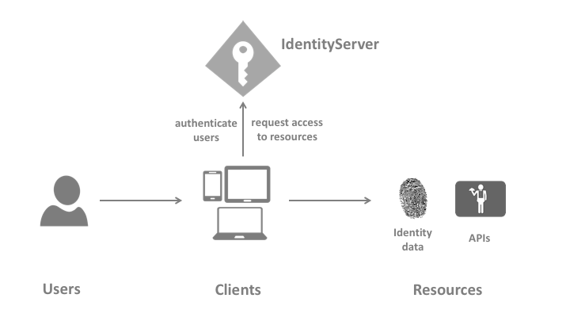
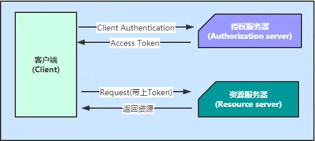
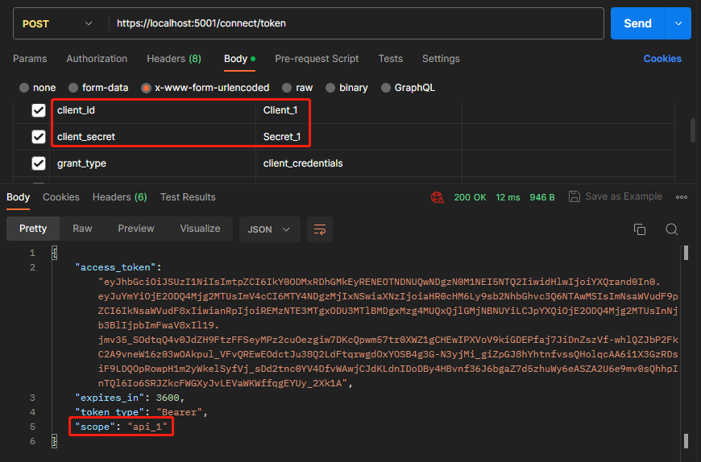
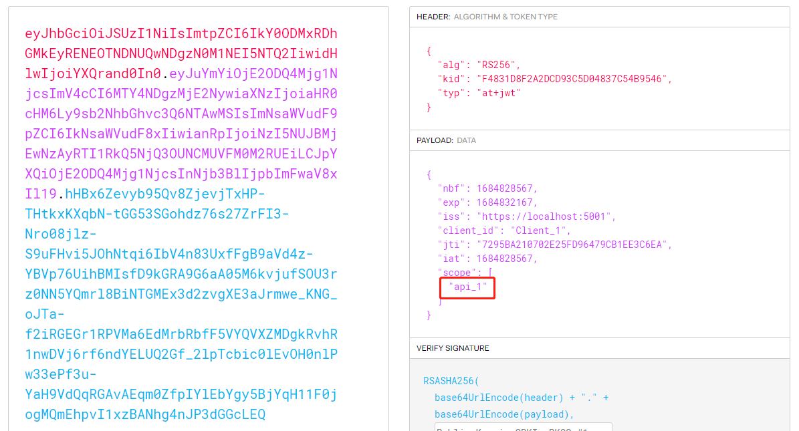
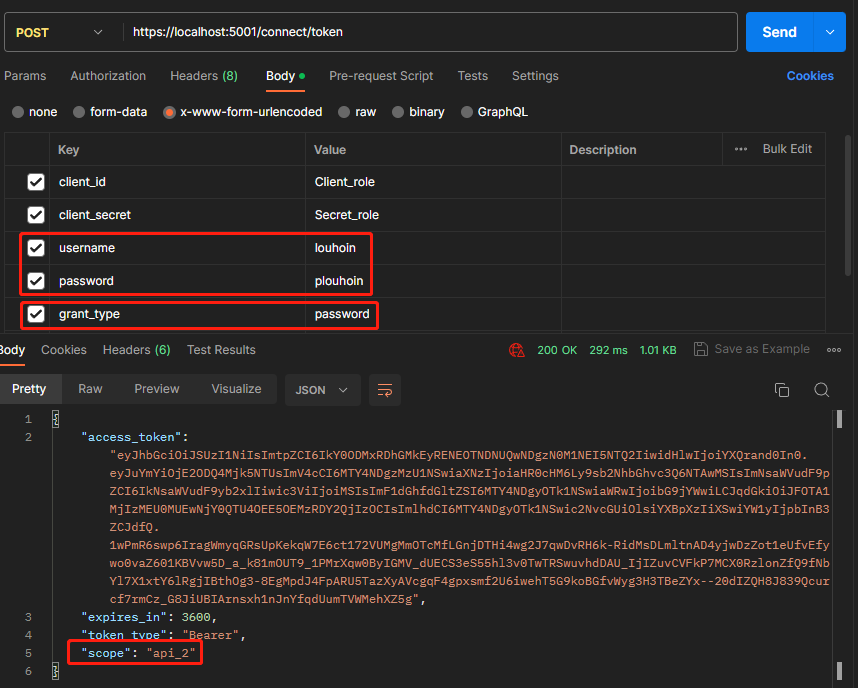
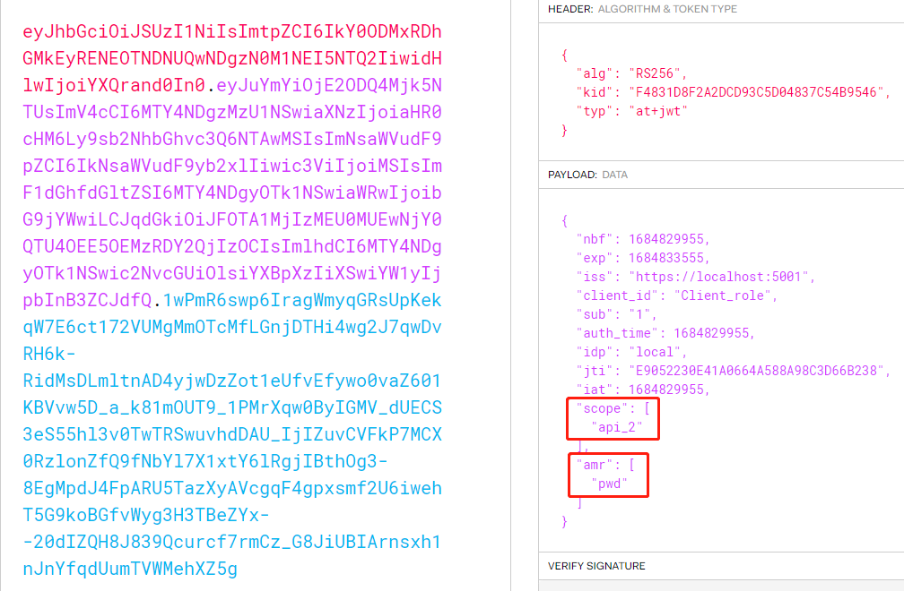
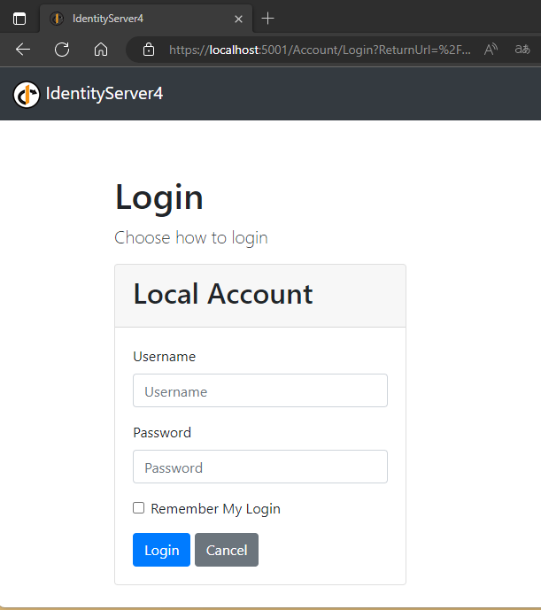
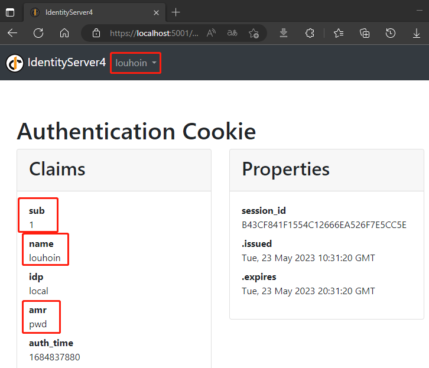

# 授权认证模块
系统采用IdentityServer4作为身份验证和授权框架，可与各种客户端类型集成，包括Web、桌面和移动应用程序。并且开发人员能够自定义身份验证和授权流程。它支持多种身份验证方案，包括基于用户名/密码、Active Directory和外部身份提供者（例如Google和Facebook）等。在授权方面，它支持角色和声明等传统的访问控制方法，同时也支持基于策略和要求的细粒度授权。

采用IdentityServer4认证和授权框架代替传统的身份验证。并通过以下特点解决前面题到的部分问题：
- （1）安全性高：IdentityServer4提供了丰富的安全特性，包括基于角色的访问控制、OAuth2和OpenID Connect等标准认证协议、多因素身份验证等功能，可以保护Web应用程序免受各种攻击。
- （2）灵活性强：IdentityServer4提供了可扩展的插件体系结构，可以自定义认证流程、存储机制、令牌生成等方面的逻辑。此外，它还支持多种客户端类型（例如Web应用程序、移动应用程序、API等），可以满足不同场景的需求。
- （3）易于集成：IdentityServer4提供了丰富的SDK和示例代码，可以快速地集成到各种编程语言和框架中，并且与ASP.NET Core框架无缝地集成，使得在ASP.NET Core应用程序中进行认证和授权非常方便。

 

## **IdentityServer4（IDS4）**
* 是为ASP.NET Core 系列打造的基于OpenID Connect 和 OAuth 2.0的认证授权框架。
* OAuth2.0是一个开放授权标准，允许用户授权第三方应用访问该用户在某服务上的私有资源。
* OIDC = （Identity Authentication + OAuth2.0。是一个基于OAuth2.0协议的身份认证标准协议。

 

## **优点**
* **安全性高**：包括基于角色的访问控制、OAuth2和OIDC等标准认证协议，保护应用程序。
* **灵活性强**： 使用大量插件，支持多种客户端类型，满足不同场景需求。
* **易于集成**：提供丰富的SDK和实例代码，便于快速集成。
* **监控数据流转**：在认证、授权、服务请求等关键操作上触发时间，通过订阅时间来监控数据流转。

 

## **术语**

**1. Users**： 用户

**2. Clients**： 客户端

**3. Resources**: Identity data、 APIs

**4. Identity Server** : 认证服务器

**5. Token**:  Identity Token(身份令牌)、 Access Token(访问令牌)

 

___

## **Claim**
在IdentityServer4中，Claim是一个非常重要的概念，用于表示用户或客户端相关信息的数据结构，通常包含用户的身份信息、权限、属性等内容，并且可以在授权过程中通过令牌传递给Web应用程序。

1. 在IdentityServer4中定义Claim类型：可以使用`AddClaimType()`和`AddClaimValue()`方法将自定义的Claim类型和值添加到IdentityServer4中。【例如】，您可以添加名为`role:"user"`Claim类型，用于表示用户的角色信息。
2. 授权请求中包含Claim：当用户进行身份验证时，可以通过IdentityServer4的API将Claim添加到授权请求中。【例如】，您可以将用户的角色信息添加到授权请求中，以便后续在授权成功后将其加入到生成的令牌（Token）中。
3. 令牌中包含的Claim：在IdentityServer4中，使用`Configure<IdentityServerJwtDescriptor>`方法来配置生成的JWT令牌中包含哪些Claim。例如，您可以将用户的角色信息添加到令牌中，以便在Web应用程序中验证用户的身份和权限。

 

## **JWT Token**
在IdentityServer4中，JWT令牌（JSON Web Token）是用于表示用户或客户端身份和授权信息的一种标准化方式。JWT令牌由三部分组成：头部（Header）、负载（Payload）和签名（Signature）。其中，头部用于指定JWT使用的算法和类型；负载包含了Claim等信息；签名用于验证JWT的真实性和完整性。JWT令牌是用于表示用户或客户端身份和授权信息的一种标准化方式，并且可以通过JWT配置、签名和加密等操作来保证令牌的真实性和安全性。在Web应用程序中，需要对JWT令牌进行验证和解析，以确保用户的身份和授权信息的有效性和正确性。

1. 在IdentityServer4中定义JWT配置：可以通过`Configure<IdentityServerJwtDescriptor>`方法来定义JWT的配置信息，例如签名秘钥、过期时间等。
2. 在授权成功后生成JWT令牌：当用户进行身份验证并授权成功后，IdentityServer4会生成一个JWT令牌，并将其发送给Web应用程序。在生成JWT令牌时，需要根据定义的JWT配置信息进行签名和加密，以确保令牌的真实性和安全性。
3. 在Web应用程序中验证JWT令牌：在Web应用程序中，需要使用IdentityServer4提供的SDK或第三方库来验证JWT令牌的真实性和有效性。具体来说，需要对JWT令牌进行解析、验签、验证签发者和过期时间等信息。

 

## **授权模式**
## **客户端模式(Client Credentials)**
### **认证流程**

1. 客户端访问授权服务器，服务器校验后返回Access Token.
2. 客户端使用Access Token访问资源服务器。

 

## **postman测试结果**
**携带客户端id和secret访问授权服务器**

 

**获得的Access token**

 

## **密码模式（ Resource Owner Password Credentials）**
**携带账号和密码访问授权服务器**

 

**获得的Access token**

 

## **OIDC**

 

 

## **代码目录**
IdentityServer4-master

    ├─Client
    ├─IdentityServer
    ├─MvcClient
    └─WebApi
