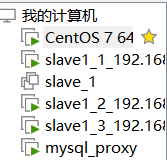
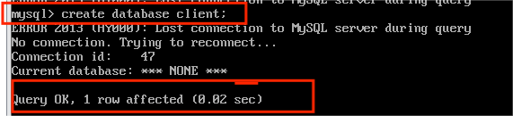
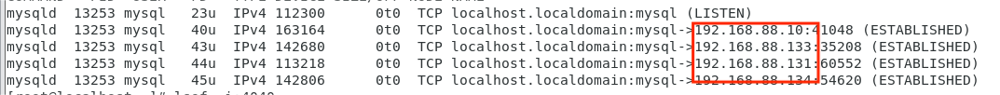
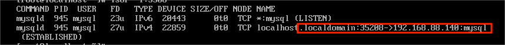

# Read/WriteSplitting（读写分离）

## 背景
当今的互联网应用呈现出随机访问和数据库查询频度都非常高,而数据更新的频度相对比较低的特点。人们对互联网上应用服务也提出更高的要求,传统的数据库服务器已经很难满足当前互联网的需要。在这种需求下,具有可靠性、高可用性和高扩展性特点的集群技术应运而生。但是集群技术的产生带来一些急需要解决的问题：负载均衡、读写分离、透明访问等。MySQL Proxy就是这样的一种数据库集群中间件,可以很好的解决这些问题。程序员只需要连接到这个中间件,就可以访问到数据集群,他们不需要了解集群的系统结构,而由数据库集群中间件来处理负载均衡、读写分离等问题。

## MySQL-proxy与sharding-jdbc对比
1. 首先考虑到jdbc使用分库分表模式，能够将大量数据进行分库分表去部署在不同的服务器上，避免由于大量的数据存储引起MySQL的性能的下降。<p>
2. 但是，相对而言，jdbc仅是实现处理了负载均衡的问题，还是没有从根源上解决读多写少的问题，因此，实现部署一个以多个从库提供读取数据的服务显得是十分必要的，在这里，MySQL-proxy这个工具就比较完美的解决了这个问题，它是实现在代理服务器通过在4040端口监测用户端的请求，再在该代理服务器分析请求，如果是读的服务，自动分配到从库，插入或更新数据则是使用主库<p>

## 实现
使用虚拟机（lniux环境下）进行创建多个服务器的，达到创建多个服务器：
````
数据库配置
主库服务器：Centos（192.168.88.140）                                                
从库服务器：slave1_1（192.168.88.131）、slave1_2（192.168.88.132）       slave1_3（192.168.88.134）
代理服务器：mysql_proxy（192.168.88.135）
````

<p>

客户端（192.168.88.135）创建client库<p>
<p>

主库端口监听：
<p>

从库端口监听:
<p>


代理服务器端口监听：
- 该位于192.168.88.10代理端所示：
    - 192.168.88.140为master，既是进行主库更改
    - 192.168.88.131为slave，既是进行从库读取
    - 192.168.88.135为client，客户端，进行操作
    
<p>

## 问题分析
### 进行主从复制问题分析：
- 使用虚拟机时候，在进行多个服务器创建的时候，使用克隆服务器达到创建多个服务器
由于MySQL在实现主从复制的时候，需要使用到UUID进行通信，在进行主从复制的时候，由于克隆机的原因，UUID一致，将会导致一直出现通信问题，此时，需要修改UUID<p>
- 隐藏问题：在使用克隆机的时候，当需要修改UUID的时候，需要修改的位数一直，否则将会出现MySQL无法启动且sock文件无法找到，进而无法启动MySQL本地服务问题

- 进行主从复制的时候，出现binlogs报错，导致I/O线程无法实现工作
原因：因为master中存在一些操作在slave中无法实现,该方法是使得slave中的delay跳过错误日志。
- ````
  Stop slave；
  set global sql_replica_skip_counter=1;
  Reset slave；
  Start slave；
  ````


### 进行读写分离错误分析：
- MySQL-proxy客户端通过监测端口（4040）监测问题：当客户端通过4040端口登录代理服务端时候，可能会出现无法通过该端口连接问题
- 解决：
- ````
  进行编写my.cnf文件，为 vi /etc/my.cnf
  加上取消固定IP登录：
  Blind-address=0.0.0.0
  ````

## 资料
[数据库集群中间件MySQL Proxy研究与分析](https://kns.cnki.net/kcms2/article/abstract?v=fDc5t50kiLLMefmH27D-CcoDCuHNzkmJwHOLgZQDAn7SViHXluZt1WpAvkRyg9wMfCoUXtqsiDGOrI2DZqTASuLqCeNFNe4It-R607KvklKNNaZFT5VJf-PzdGViatnu5CQ0JVkGclrRs-6QHCpBJJq-13G8pLdB&uniplatform=NZKPT)<p>
[MySQL关系数据库的读写分离的四种方案](https://blog.csdn.net/inrgihc/article/details/108293738)<p>
[mysql proxy搭建_搭建mysqlproxy的过程](https://blog.csdn.net/weixin_30986285/article/details/113910018)<p>
[数据库系列之MySQL基于MySQL-proxy实现读写分离](https://blog.csdn.net/solihawk/article/details/117697556)<p>